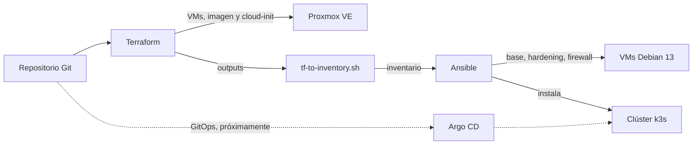

# Plataforma híbrida reproducible con IaC y GitOps

Trabajo Final de Grado · CFGS Administración de Sistemas Informáticos en Red (ASIR)
**Autor:** Ignacio Gaitán · 2026

Plataforma de infraestructura definida como código que se crea, configura y mantiene de forma
automática a partir de este repositorio. Funciona sobre Proxmox VE (on-premise) y está diseñada
para extenderse a la nube con el mismo código.

## Arquitectura



| Capa | Herramienta | Función |
|---|---|---|
| Provisión | Terraform (`bpg/proxmox`) | Imagen Debian 13, snippet de cloud-init y VMs en Proxmox |
| Configuración | Ansible | Paquetes base, hardening SSH, firewall UFW y clúster k3s |
| Orquestación | k3s `v1.36.5+k3s1` | Kubernetes ligero, sin Traefik integrado |
| GitOps | Argo CD | *En desarrollo* |
| Calidad | pre-commit, GitHub Actions | Formato, validación y detección de secretos |

## Requisitos

- Proxmox VE 9.x con un usuario y token de API para Terraform.
- Equipo de administración con `terraform`, `ansible`, `jq`, `kubectl`, `make` y `pre-commit`.
- Archivo `.env` con las credenciales de Proxmox (ver `.env.example`).

Guía completa: [Configuración inicial](docs/runbooks/configuracion-inicial.md).

## Uso rápido

```bash
ssh-add ~/.ssh/id_ed25519
make help      # lista de comandos disponibles
make deploy    # Terraform + inventario + Ansible: de cero a clúster k3s
make status    # estado del clúster
make check     # comprueba que no hay cambios pendientes (idempotencia)
make rebuild   # destruye y vuelve a crear toda la plataforma
```

Procedimiento detallado: [Puesta en marcha](docs/runbooks/puesta-en-marcha.md).

## Seguridad

- Credenciales fuera del repositorio (`.env`, kubeconfig en `~/.kube/`) y detección de secretos con pre-commit.
- CI sin credenciales en cada PR (gitleaks sobre todo el historial y hooks de pre-commit), obligatoria para fusionar en `main`.
- Token de API de Proxmox con permisos mínimos; permisos de borrado limitados al almacenamiento de imágenes.
- SSH solo con clave pública, sin acceso de `root` ni contraseñas.
- Firewall UFW con política de entrada denegada: solo SSH, la API de Kubernetes y las redes internas del clúster.

## Pruebas de reproducibilidad

| Prueba | Alcance | Resultado | Tiempo |
|---|---|---|---|
| [Reconstrucción 1](docs/pruebas/2026-10-03-reconstruccion-1.md) | VM + configuración base | Parcial (3 fallos corregidos) | 26 min 37 s |
| [Reconstrucción 2](docs/pruebas/2026-10-04-reconstruccion-2.md) | VM + configuración base | ✅ Superada | 9 min 26 s |
| [Reconstrucción 3](docs/pruebas/2026-10-05-reconstruccion-3.md) | + firewall + k3s + kubectl | ✅ Superada | 8 min 35 s |
| [Reconstrucción 4](docs/pruebas/2026-10-07-reconstruccion-4.md) | + Argo CD + Traefik + Ingress (`make rebuild`) | ✅ Superada | 5 min 25 s |

## Estructura del repositorio

```
terraform/   Provisión: módulos (imagen, VM) y entornos (onprem, cloud)
ansible/     Configuración: inventarios, playbooks y roles
gitops/      Manifiestos que despliega Argo CD (App of Apps)
scripts/     Utilidades (generación del inventario, bootstrap)
docs/        Arquitectura, decisiones (ADR), runbooks, pruebas y diario
```

## Estado

- [x] Provisión de VMs en Proxmox con Terraform y cloud-init
- [x] Configuración base, hardening SSH y firewall con Ansible
- [x] Clúster k3s de un nodo y acceso con `kubectl`
- [x] GitOps con Argo CD (App of Apps) y aplicación de demostración
- [x] Ingress con Traefik e interfaz de Argo CD por HTTPS
- [ ] Bastión SSH (Warpgate) y VPN en malla (NetBird)
- [ ] Entorno cloud y clúster de varios nodos
- [x] CI en GitHub Actions: Terraform, Ansible, gitleaks y pre-commit en cada PR
- [ ] Gestión de secretos (SOPS), monitorización y copias de seguridad

Pendientes y mejoras: [docs/pendientes.md](docs/pendientes.md).

## Documentación

- [Arquitectura](docs/arquitectura.md)
- [Decisiones de diseño (ADR)](docs/adr/)
- [Runbooks](docs/runbooks/)
- [Diario del proyecto](docs/diario/)
