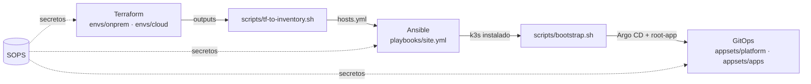

# Arquitectura general

↑ [Mapa del repositorio](README.md)

La plataforma combina un entorno **on-premise** (hipervisor Proxmox) y un entorno **cloud**, gestionados de forma declarativa en tres capas: provisión con Terraform, configuración con Ansible y entrega de aplicaciones con GitOps (Argo CD).

> [!todo] Pendiente de validar
> El contenido refleja la estructura del repositorio. Los detalles (proveedor cloud, número de nodos, direccionamiento) se completarán cuando se implementen los ficheros correspondientes.

## Flujo de despliegue

## 1. Provisión: Terraform

Decisión: [0002-terraform-ansible-separacion](adr/0002-terraform-ansible-separacion.md)

| Elemento | Función | Código |
|---|---|---|
| Entorno on-prem | VMs en Proxmox para nodos `core` y `k3s` | [envs/onprem/main.tf](../terraform/envs/onprem/main.tf) |
| Entorno cloud | VM(s) en proveedor cloud | [envs/cloud/main.tf](../terraform/envs/cloud/main.tf) |
| Módulo `proxmox-image` | Plantilla base (imagen cloud-init) | [modules/proxmox-image/](../terraform/modules/proxmox-image/main.tf) |
| Módulo `proxmox-vm` | VM reutilizable en Proxmox | [modules/proxmox-vm/](../terraform/modules/proxmox-vm/main.tf) |
| Módulo `cloud-vm` | VM reutilizable en la nube | [modules/cloud-vm/](../terraform/modules/cloud-vm/main.tf) |
| Estado remoto | Backend por entorno | [onprem/backend.tf](../terraform/envs/onprem/backend.tf), [cloud/backend.tf](../terraform/envs/cloud/backend.tf) |
| Credenciales | Variables sensibles fuera del repositorio | `secrets.auto.tfvars.example` en cada entorno |

Los `outputs.tf` de cada entorno exponen los datos de los hosts (nombre, IP, grupo) que consume la capa de configuración.

## Plan de IPs (on-prem)

Red `192.168.1.0/24`, puerta de enlace `192.168.1.1`, nodo Proxmox `ngtn-server` (`192.168.1.90`).
Las VMs usan el bloque reservado `192.168.1.100–119`, con un rango por rol:

| Rango | Uso | Asignadas |
|---|---|---|
| `.100` | Reservada (futura VIP o API del clúster) | — |
| `.101–.109` | Nodos k3s | `k3s-01` (`.101`, 2 vCPU, 4 GB) |
| `.110–.114` | Servicios core | `core-01` (`.110`, 1 vCPU, 512 MB) |
| `.115–.119` | Reserva (PBS, pruebas) | — |

Las IPs se fijan en [terraform.tfvars](../terraform/envs/onprem/terraform.tfvars). `core-01` tiene
512 MB porque el nodo (8 GB) solo tenía ~1,3 GiB libres con `k3s-01` en marcha; Warpgate consume
unos 43 MiB.

## 2. Puente Terraform → Ansible

[scripts/tf-to-inventory.sh](../scripts/tf-to-inventory.sh) transforma `terraform output` en los inventarios de Ansible:

- `terraform/envs/onprem` → [inventories/onprem/hosts.yml](../ansible/inventories/onprem/hosts.yml)
- `terraform/envs/cloud` → [inventories/cloud/hosts.yml](../ansible/inventories/cloud/hosts.yml)

De este modo la fuente de verdad del inventario es Terraform y se evita mantener IPs a mano.

## 3. Configuración: Ansible

Decisiones: [0002-terraform-ansible-separacion](adr/0002-terraform-ansible-separacion.md), [0001-eleccion-k3s](adr/0001-eleccion-k3s.md)

| Playbook | Alcance previsto | Roles |
|---|---|---|
| [site.yml](../ansible/playbooks/site.yml) | Orquesta los demás playbooks | — |
| [base.yml](../ansible/playbooks/base.yml) | Todos los hosts | `common`, `hardening`, `node_exporter` |
| [core.yml](../ansible/playbooks/core.yml) | Grupo `core` ([group_vars](../ansible/inventories/onprem/group_vars/core.yml)) | `warpgate` (previstos: `docker`, `netbird`, `authentik`) |
| [k3s.yml](../ansible/playbooks/k3s.yml) | Grupo `k3s` ([group_vars](../ansible/inventories/onprem/group_vars/k3s.yml)) | `k3s` |

Servicios de la capa *core* (fuera del clúster):

- **NetBird**: malla VPN (WireGuard) que une on-prem y cloud.
- **Warpgate** (implementado en `core-01`): bastión SSH con control de acceso por roles y grabación
  de sesiones. Es el único acceso SSH humano a las VMs; usuarios, roles, destinos y huellas se
  declaran en [group_vars/core.yml](../ansible/inventories/onprem/group_vars/core.yml) y se aplican
  con su API. Ver [acceso-warpgate](runbooks/acceso-warpgate.md).
- **Authentik**: proveedor de identidad (SSO) para los servicios de la plataforma.
- **node_exporter**: métricas de host consumidas por `monitoring` en el clúster.

Configuración común: [ansible.cfg](../ansible/ansible.cfg), colecciones en [requirements.yml](../ansible/requirements.yml).

## 4. Entrega continua: GitOps

Decisión: [0003-gitops-argocd](adr/0003-gitops-argocd.md)

| Aplicación | Ruta | Depende de |
|---|---|---|
| Argo CD | [bootstrap/argocd/](../gitops/bootstrap/argocd/kustomization.yaml) | Clúster k3s ([0001-eleccion-k3s](adr/0001-eleccion-k3s.md)) |
| Root app | [bootstrap/root-app.yaml](../gitops/bootstrap/root-app.yaml) | Argo CD |
| Traefik | `gitops/platform/traefik/` | k3s (Traefik integrado desactivado, ver [0001-eleccion-k3s](adr/0001-eleccion-k3s.md)) |
| cert-manager | `gitops/platform/cert-manager/` | Traefik (TLS de los Ingress) |
| Monitoring | `gitops/platform/monitoring/` | Rol `node_exporter` en los hosts |
| Loki | `gitops/platform/loki/` | Monitoring (Grafana) |
| Velero | `gitops/platform/velero/` | Almacenamiento de copias, ver [restauracion](runbooks/restauracion.md) |
| demo-app | `gitops/apps/demo-app/` | Plataforma desplegada |

Las ApplicationSets [platform.yaml](../gitops/appsets/platform.yaml) y [apps.yaml](../gitops/appsets/apps.yaml) generan una `Application` por cada subdirectorio de `platform/` y `apps/`.

## 5. Secretos

Decisión: [0004-gestion-secretos-sops](adr/0004-gestion-secretos-sops.md): reglas en [.sops.yaml](../.sops.yaml); ficheros cifrados en [secrets/](../secrets/).

## CI y seguridad

| Workflow | Función prevista | Estado |
|---|---|---|
| [terraform.yml](../.github/workflows/terraform.yml) | `fmt`, `validate`, `plan` | Placeholder |
| [ansible.yml](../.github/workflows/ansible.yml) | `ansible-lint`, sintaxis | Placeholder |
| [security.yml](../.github/workflows/security.yml) | Análisis de IaC y detección de secretos | Placeholder |

Validaciones locales con [.pre-commit-config.yaml](../.pre-commit-config.yaml).

## Procedimientos relacionados

- [puesta-en-marcha](runbooks/puesta-en-marcha.md)
- [añadir-nodo](runbooks/añadir-nodo.md)
- [restauracion](runbooks/restauracion.md)
